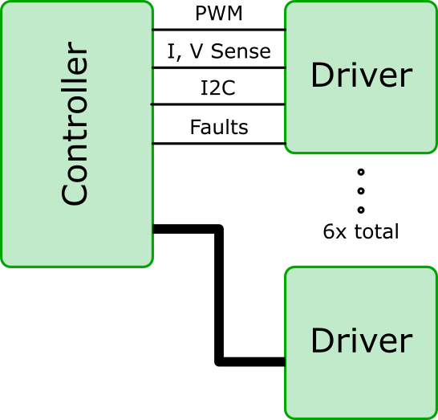
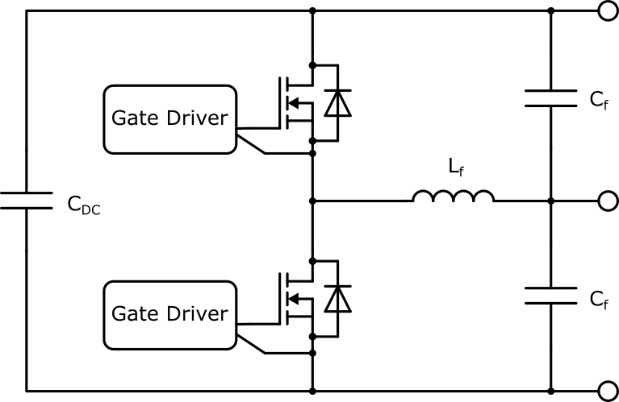

# Power Electronics Rapid Prototyping Platform

## Motivation

With power needs increasing for things like robotics, EVs, and data centers, there is an increased demand for custom power electronics topologies. Development of a besoke solution for every new topology would be intensive, requiring 3-6 months of engineering time and thousands of dollars in components and PCB costs. Instead, PERPP allows for rapid development of any topology, with time spent specifying only a few critical components, rather than an entirely new PCB.

Suppose you were developing a dual active bridge system and you wanted to get some lab data to investigate whether or not this system can power your load in the way you want it to. Instead of spending the time developing a DAB from scratch, you would only need to spec a transformer, inductor, and ensure that the DC bus capacitance is appropriate. This would take about a week, rather than the months for a custom system.

## Schematic

The actual schematics for this are proprietary to ADI, however an overview of the system is provided.

## Technical Specifications

### Controller Board

Hardware Features
- STM32H755 MCU
- RMII Ethernet
- ISOSPI
- HRTIM PWM
- ADCs for voltage and current sensing
- Hardware Fault Interrupts

Software Features
- Embassy rust firmware
- Supported topologies
    - Buck
    - Boost
    - Buck-Boost
    - Single Phase AC
    - Three Phase AC
    - Dual Active Bridge

### Driver Board

Hardware Features
- SiCFET switches
- Isolated gate drive with desat protection
- Isolated voltage and current measurement
- FET temperature measurement

Power Supply Cababilities
- 900 V
- 50 App