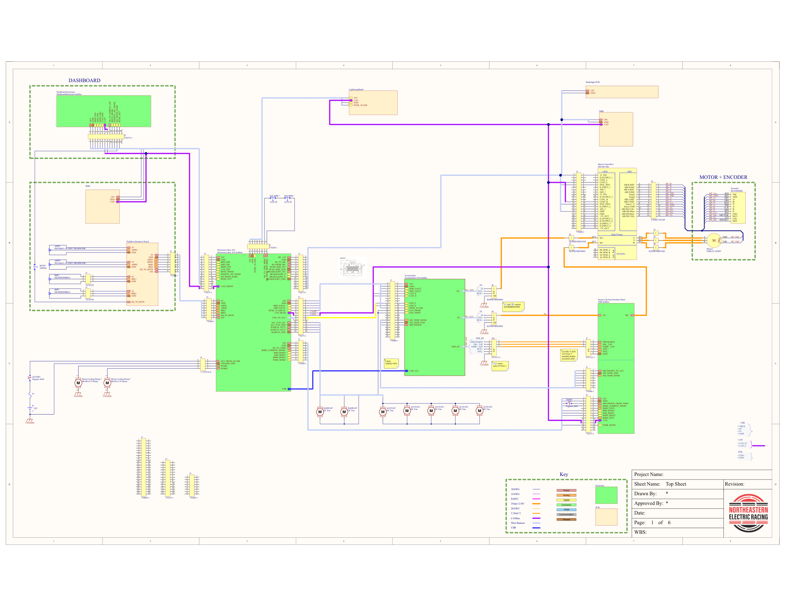
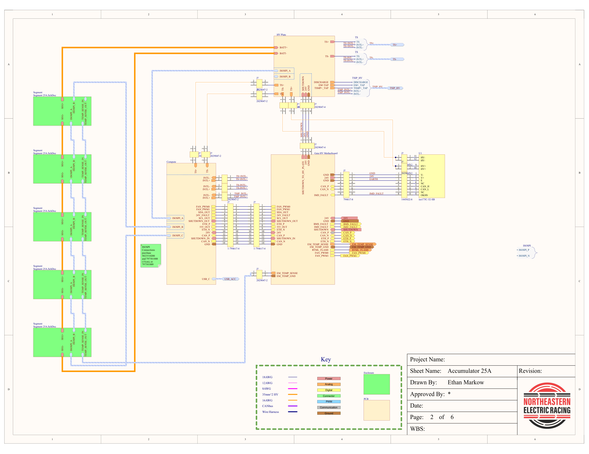
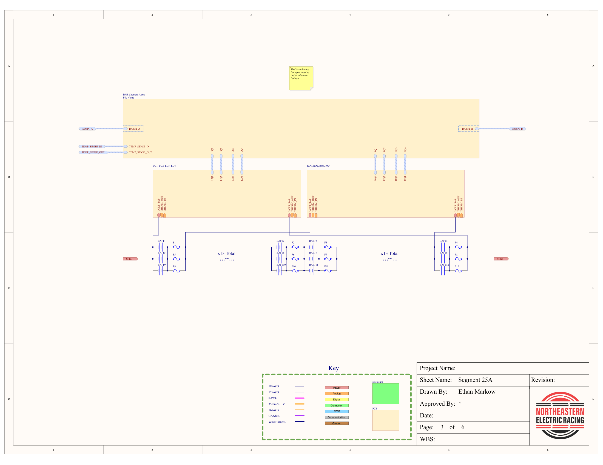
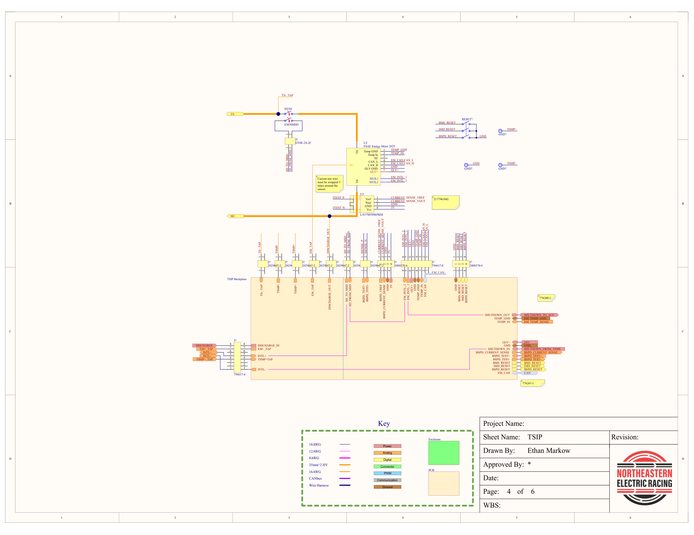
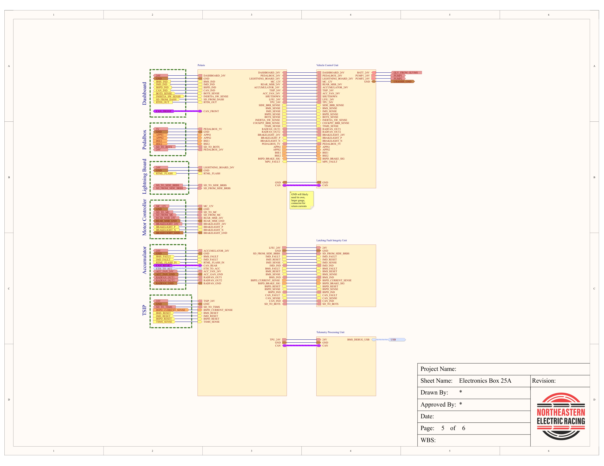
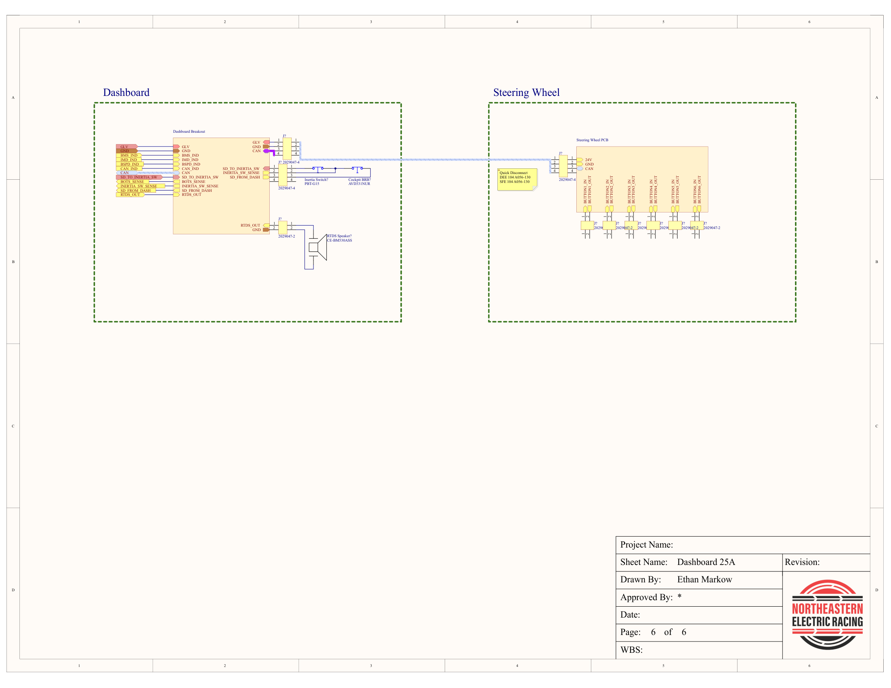

# Chief Electrical Engineer

Between July 2025 and June 2026 I served as the Chief Electrical Engineer for Northeastern Electric Racing. In this position I was responsible for the entire electrical system of the 25A competition vehicle, including technical specifications, budgets, timelines, and personel management. This was a very stressful and demanding position, but also one that I found to be quite rewarding.

## Responsibilities

### Team Management

I managed 3 teams of engineers: Low Voltage, Powertrain, and Firmware. Each of these systems had a head, who reported directly to me, and a set of leads, responsible for their projects. Each project has 1-2 leads depending on it's complexity and the interest of the members of the club.
#### Low Voltage
The LV team (also known as Electronics) is responsible for most of the control and sensing hardware on the vehicle. Their Projects include:
- Vehicle Control Unit (VCU)
    - The VCU is the main control board for the vehicle. It has two primary responsibilities: commanding the inverter and distributing low voltage power. The 25A VCU featured improvements over the 24A implementation by combining the Main Processing Unit (MPU) with the Power Distribution Unit (PDU) as well as implementing Automotive Ethernet.

- Telemetry Processing Unit (TPU)
    - The TPU handles the wireless telemetry for the vehicle, it is a raspberry Pi with a custom hat allowing the Pi to read the CAN bus and transmit data over HaLow WiFi.
    - 25A saw the start of development for what will be known as TPU 3. TPU 3 uses a Pi 5 Compute Module, implements automotive ethernet, more accurate GPS, and updated Wifi. Budgetary constraints prevented it's purchase during the 2025-26 competition year, however, it is still being developed and will be purchased eventually

- Latching Fault Integrity Unit (LFIU)
    - The LFIU takes in the fault inputs from the BMS, IMD, BSPD, and VCU and ensures that the high voltage system is deactivated if something unsafe occurs. The board also implements threshold sensing to read the application of power in the tractive system and the brake system pressure to prevent commanding current and braking at the same time.

- Steering Wheel
    - The steering wheel PCB implements a Pi 5 Compute Module running a custom OS to read button inputs, display the car OS on the screen for the driver, and communicate with VCU over the CAN bus. 

- Mechanical Sensor Boards (MSB)
    - The MSB features mechanical sensors to feed information to the mechanical team on their design decisions. MSB 25A implement an IMU, gyroscope, magnetometer, shock potentiometers, load cells, pressure sensors, a steering angle sensor, a time of flight sensor, wheel speed sensors, and generic ADC drivers for yet-to-be-implemented sensors. MSB also implements automotive ethernet to send more data while lessening the load on the CAN bus.

- Lightning Board (TSSI)
    - Also known as the Tractive System Status Indicator, this board handles the indication of the fault status of the car as required by the FSAE rules, as well as acting as another MSB with movement sensors. I was the lead of this project during my tenure as Chief EE, and it's development is detailed in [Lightning Board](Lightning_Board/Lightning_Board.md).

#### Electrical Powertrain

The Electrical Powertrain team handles all things high voltage on the car, this is known as the Tractive System in FSAE. Their projects include:

- Battery Management System (BMS)
    - The BMS is the largest project of the Powertrain team, responsible for the measurement of temperature and voltage for each parallel assembly of cells and balancing the pack. The BMS consists of two PCBs, Compute, and Segment. There is one segment PCB for each module in the tractive battery. Each Segment PCB is responsible for the actual measurement and balancing of cells. Compute is responsible for communicating with each of the Segment PCBs, HV Plate, sending out critical data over the CAN bus, and triggering faults when necessary.
- Flex PCBs
    - Working alongside the Segment PCB, the Flex PCBs route traces to the terminals of each cell to measure voltage, and seperate traces to measure the temperatures in various locations. I lead this project for 25A and it's development is detailed in [Flex PCBs](Flex_PCBs/Flex_PCBs.md).
- HV Plate 
    - HV Plate handles the distribution of the high-voltage high-current lines in the car. This PCB has the IRs, main pack fuse, a large shunt resistor to measure current, and lines to measure the voltage of the Tractive System. This board also features the precharge and discharge logic for the vehicle. 

- Ready to Move Light
    - This circuitry measures the high voltage and activates a light at the top of the vehicle. This is one of the critical safety features of an FSAE car and tells the marshalls if anything particularly dangerous could be happening.

- Fusible Links
    - The fusible links connect each parallel assembly of cells and protect against short circuits within parallel assemblies.

- Tractive System Interface Panel (TSIP)
    - The TSIP handles the energy meter, MSD, TSMPs, and some other minor sensors for the Tractive System. The TSIP makes it easy for the judges to access everything they need to during inspection and events at competition.

#### Firmware
The Firmware team writes all of the code that goes onto the car. As Chief EE, I mostly let the firmware team do their own thing, but ensured that there was communication between the firmware and hardware team. The firmware projects include:
- Cerberus, the code running on the VCU
- Odysseus, the code running on TPU
- Lightning, the code running on lightning board
- MSB, the code running on the MSBs
- Shepherd, the code running on the BMS

### Goal Setting

Every year the E-Board sets goals for the team and it was my responsibility to set goals for the electrical team. I set three of these.
1. A pack size large enough to finish FH+E Endurance while pushing the whole time.
    - **Justification:** during the 2025 FH+E competition NER 24A vehicle finished the endurance run with an estimated 0% SoC. Our vehicle lapped ~5-10 seconds slower per lap compared to the two teams who placed ahead of us. Towards the end of the event, drivers were told to lift and coast, with more energy in the pack, we would have been more competitive.
    - **Action:** 24A had a pack configuration of 3P125S using the Molicel P45B 21700 cells. The 25A configuration was updated to 3P130S using the Molicel P50B. The increased number of cells and the different cell spec allowed for a 15% increase in pack capacity, while only accounting for a 4% total weight increase.
    - **Result:** Due to a multitude of issues 25A did not compete at FH+E Endurance, but post-competition testing showed that 25A was able to complete the same number of laps at a faster pace than 24A was.
2. Implementation of mechanical sensor boards to allow for mechanical validation.
    - **Justification:** In order for the mechanical team to validate their design decisions outside of simulation, they need data on how the systems behave. In the design event at both FSAE and FH+E the judges reward making data based decisions, it also allows the team to further ideas that actually work while discarding ideas that don't.
    - **Action:** MSBs were given priority as a full project with leads and members, rather than being developed on the side after competition like they were on previous cars. In addition, IMUs, Gyroscopes, and Magnetometers were added to other boards to ensure that critical inertial data was provided even if MSBs were not available.
    - **Results:** When 25A entered testing post competition, MSB was ready to be implemented and began providing valuable data to the mechanical team.
3. Implementation of Automotive Ethernet.
    - **Justification:** With the implementation of MSBs, there is going to be more data than ever sent across the car and broadcast over the telemetry system. The CAN bus can only be run stably at 500 kbps, and is limited by OEM components that do not implement CAN FD. The implementation of Automotive Ethernet allows large amounts of noncritical data to be sent at a faster speed. This reserves the CAN bus for critical communications between the VCU, motor controller, and BMS. Eventually as Automotive Ethernet gains mainstream adoption, NER will be in a position to take advantage of this.
    - **Action:** VCU and MSBs implemented Automotive Ethernet natively, while TPU implemented it as a USB extension. TPU 3 is being developed to natively support Automotive Ethernet.
    - **Results:** Both bench testing and on-vehicle testing successfully implemented automotive ethernet between VCU and TPU.

### Vehicle Architecture

The first responsibility of any Chief EE at NER is to create the master schematic for that year's competition vehicle. The master schematic defines all the electrical enclosures and PCBs present in the vehicle and what their connections are. NER 25A has two main enclosures as well as several secondary ones. The first main enclosure, LV box, contains the VCU, TPU, and LFIU, and a breakout board known as polaris. The Accumulator conains the BMS, battery modules, IMD, and HV Plate.

