# Flex PCBs

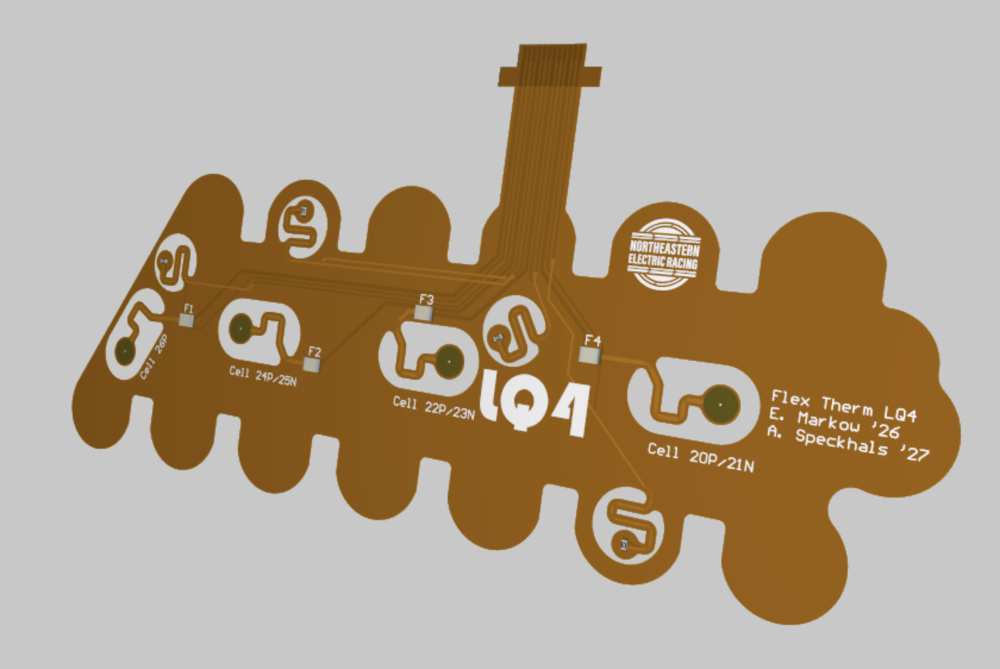

## Motivation

FPCs were used in the NER battery pack for both the 22A and 24A competition vehicles, their implementation continued with the 25A vehicle. FSAE Rules, and good BMS design, require that the voltage of every cell and the temperature of a subset of cells be monitored, along with fusing the measurements from each cell. The 22A and 24A implementations of these used a single FPC to monitor each parallel assembly of cells, and placed the fuses on the rigid BMS PCB. The 25A implementation uses 4 larger FPCs on each side of a module to monitor the cells and places the fuses on stiffened parts of the FPCs themselves.

## Technical Specifications

- 2-layer 0.12mm FPC stackup
- 0.5 oz copper
- 0.3mm polyimide stiffener

The FPCs are split into 8 total designs, 4 on the left side and 4 on the right side of a module. Each FPC senses either 3 or 4 parallel assemblies of cells, and has a fuse for each voltage tap. The FPCs are designed to be flexible enough to bend around the module to make it to the PCB, but stiff around the fuses and thermistors to ensure that they are not damaged during installation or operation. The FPCs have a 0.5mm pitch connector to connect to the BMS PCB, which is stiffened with polyimide.

## Cell and Thermistor Mapping

Drawing by Abby Speckhals
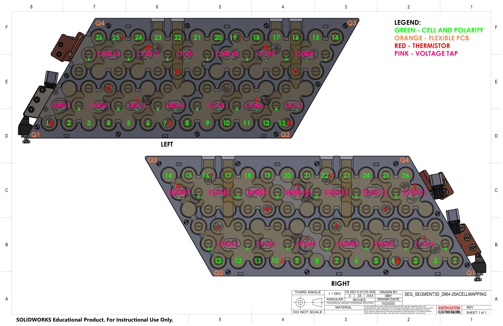

## Stackup

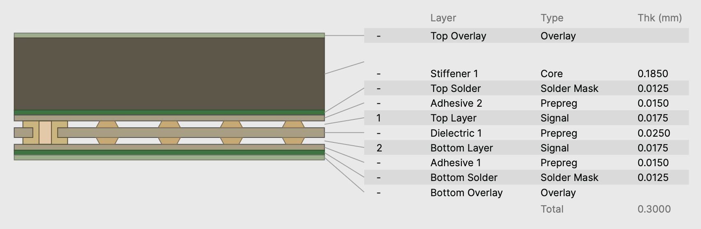

## Schematic

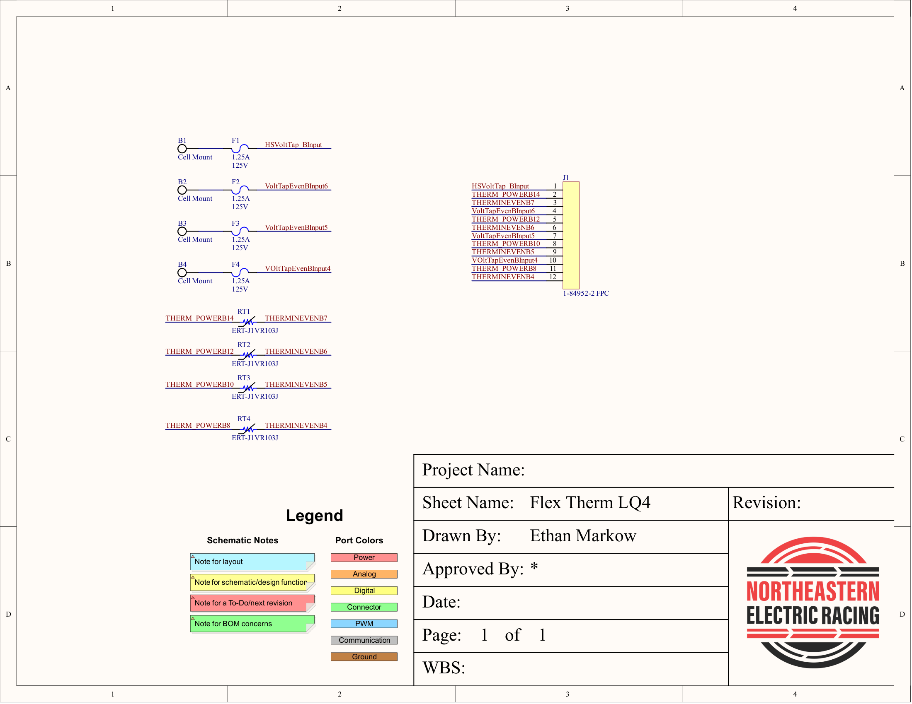

## Layouts

### LQ1

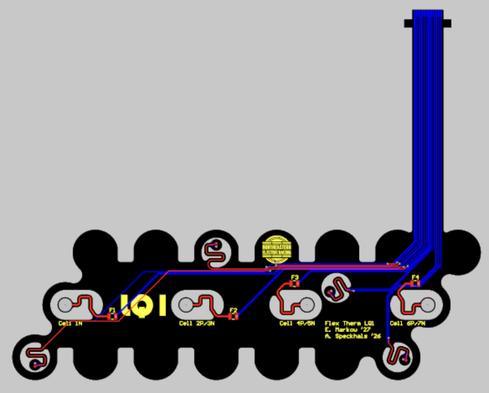

### LQ2

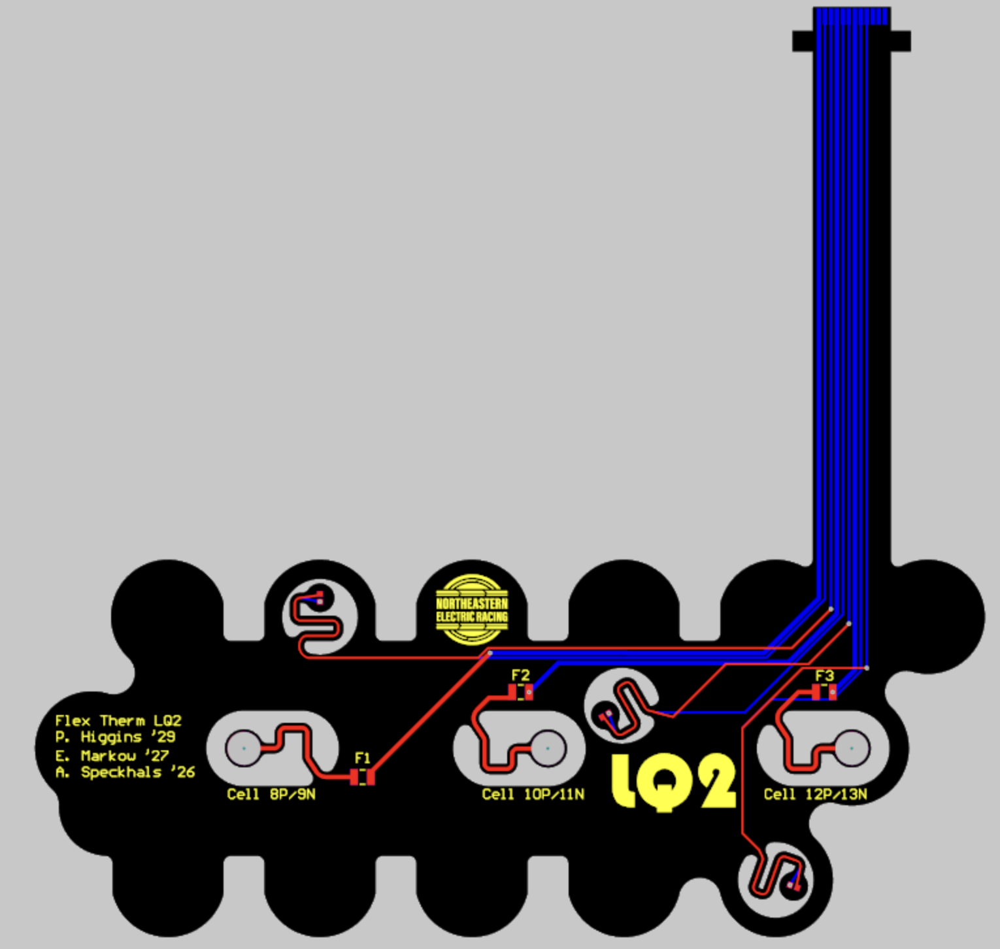

### LQ3

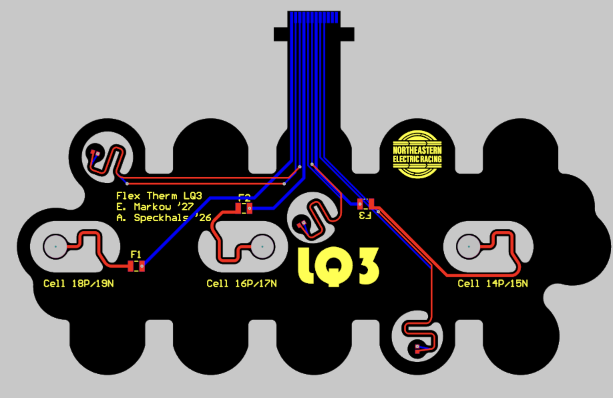

### LQ4

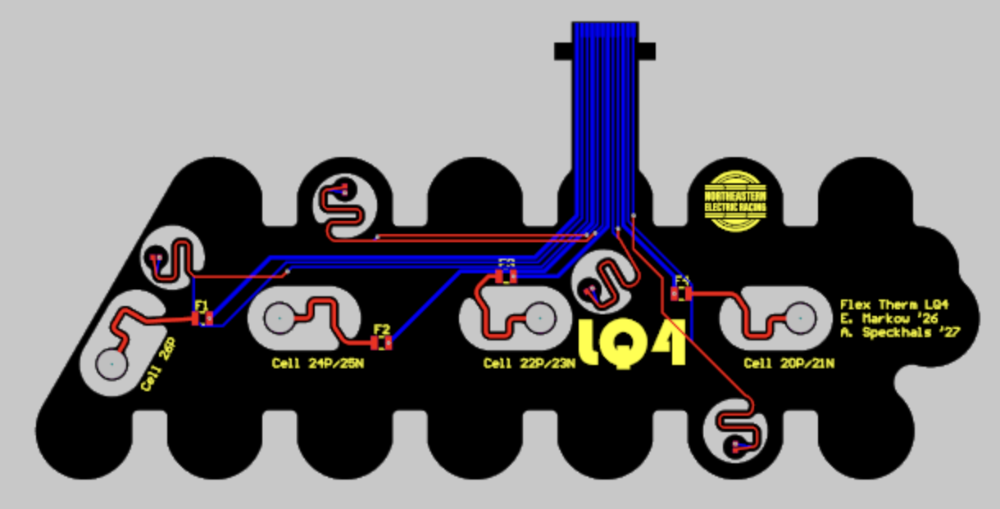

### RQ1

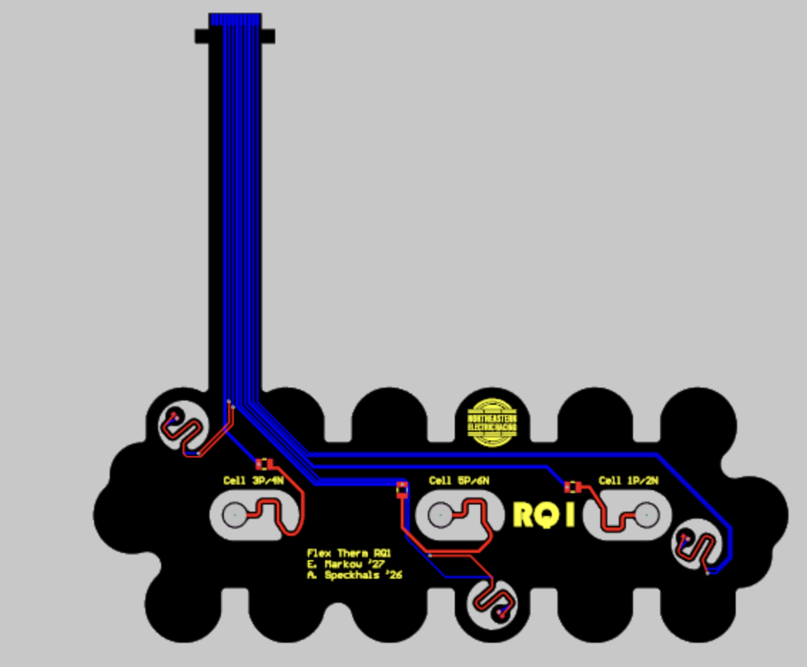

### RQ2

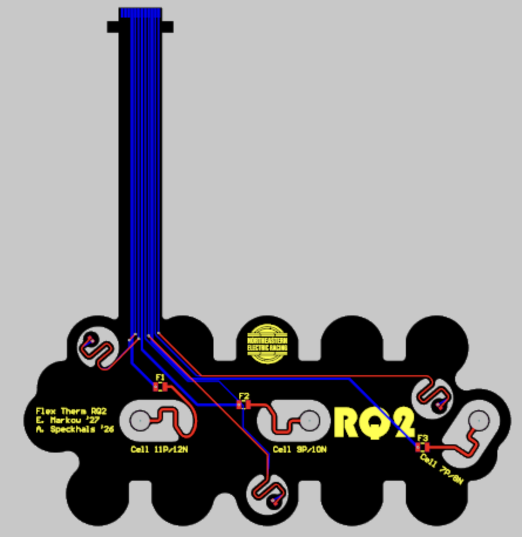

### RQ3

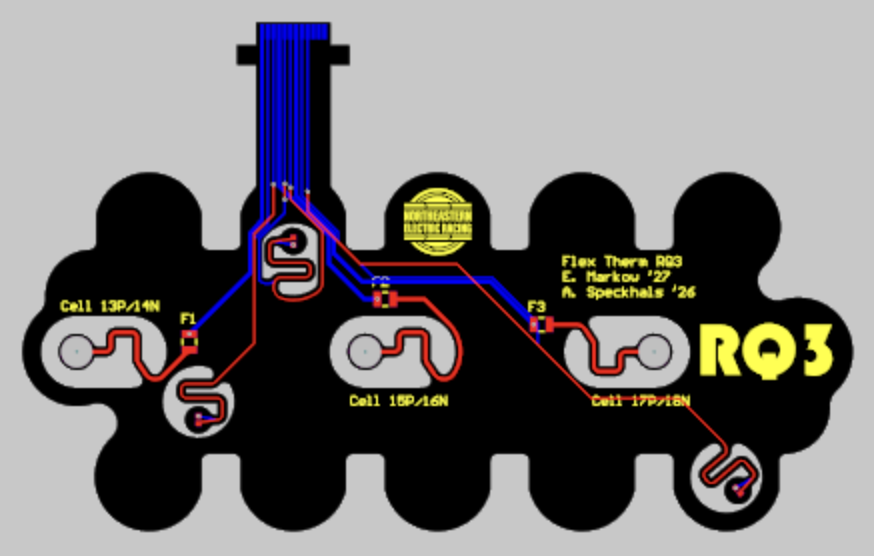

### RQ4

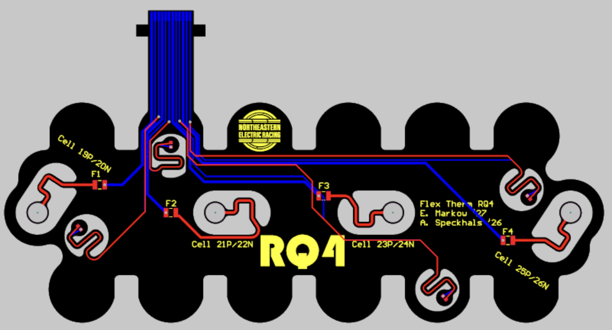