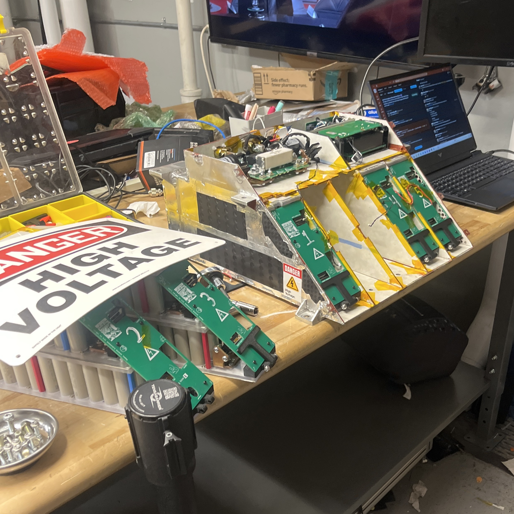

# Head of Electrical Powertrain

From December of 2024 through June of 2025 I was the Head of Electrical Powertrain on NER. I managed the electrical powertrain for the 24A competition vehicle. I was in charge of 8 electrical project leads, while co-leading the team with the head of mechanical powertrain. The previous head of electrical powertrain had left to go on co-op so I was responsible for the manufacturing and integration of the electrical powertrain system. I was responsible for ensuring the documentation provided to the competitions were accurate and complete, and that the team was on track to meet deadlines.

## 24A Accumulator

Shown below is the accumulator for the 24A competition vehicle while it was undergouing pre-competition building and testing. The accumulator was designed as a 3P125S configuration, using the Molicel P45B cell, with a total capacity of 6 kWh.

