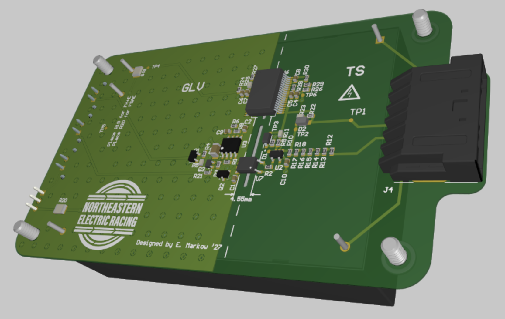
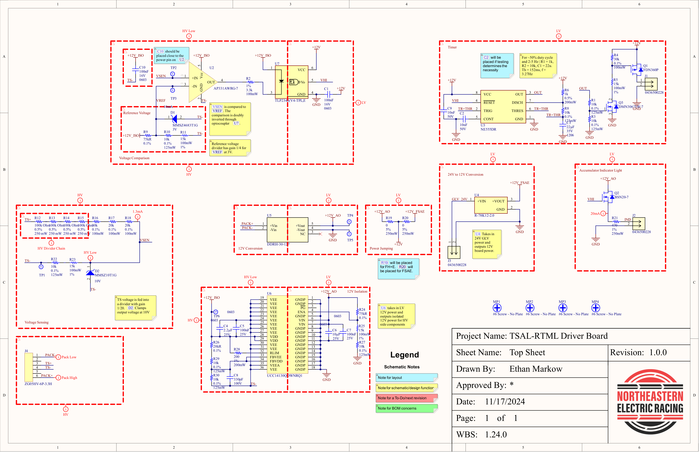
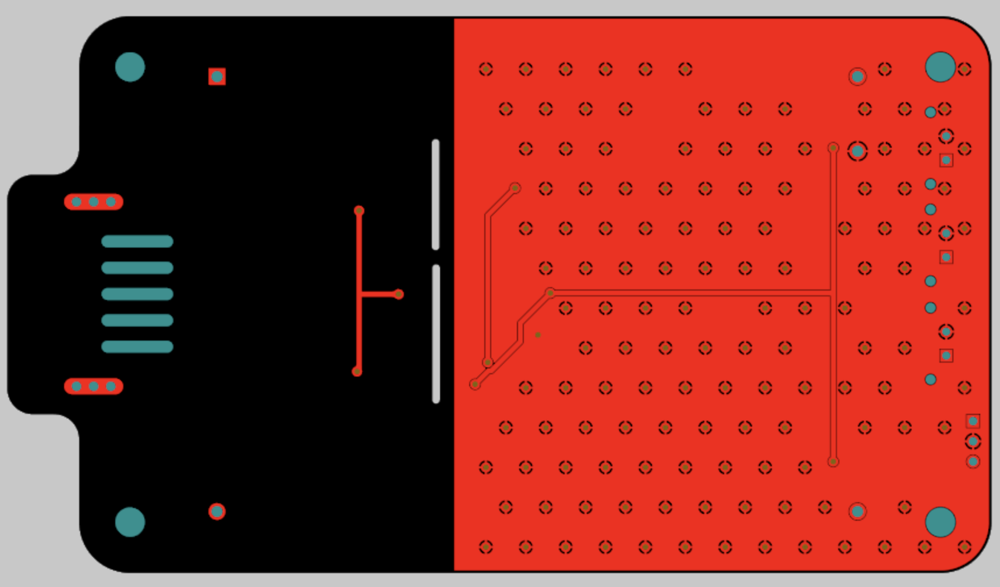
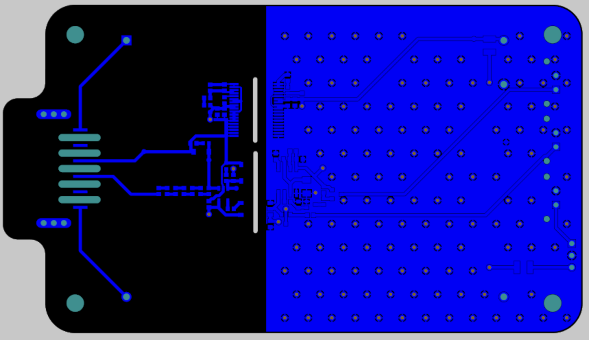

# RTML 24

## Motivation

The 2025 FSAE rules were a departure from the previous years in that they required the implementation of an amber Ready to Move Light (RTML) in addition to a red and green Tractive System Status Indicator (TSSI). The RTML light must flash at a frequency of 2-5 Hz when the tractive system voltage is greater than 60 V. The RTML board also implemented the accumulator voltage indicator, which served a similar purpose to the RTML, but did not need to flash and needed to work at all times, even when the accumulator was removed from the vehicle.

## Schematic

## Layout

