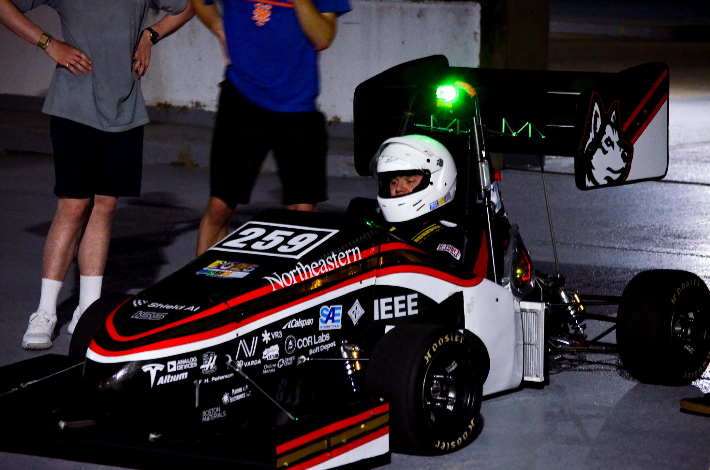

# Overview

Hello!

My name is Ethan Markow, currently a fourth year electrical engineering student at Northeastern University. This website documents some of the projects that I've worked on, both professionally and in my free time. 

The site is structured in a semi-chronological order, with things further down generally being further in the past. However, with a lot of my work being as a part of NER, which runs year round, even when I've been on internships and co-ops, there is some overlap.

Please reach out to me with any questions.

## Contact Info:

- email: [ethanmarkow@gmail.com](mailto:ethanmarkow@gmail.com)
- LinkedIn: [linkedin.com/in/ethanmarkow](linkedin.com/in/ethanmarkow)
- Github: [github.com/emarkow1](github.com/emarkow1)